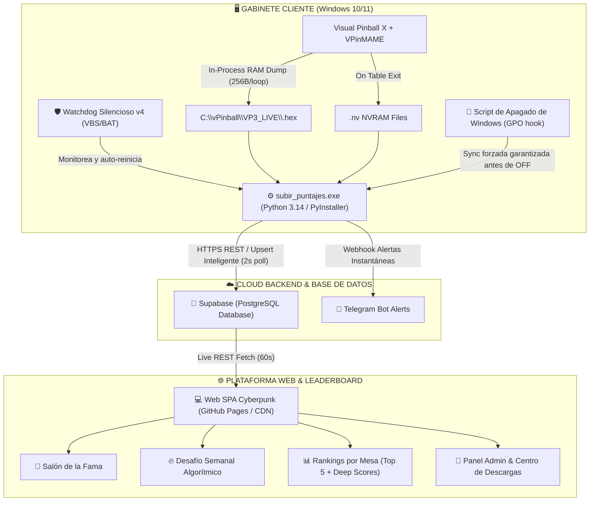

# 💎 DOSSIER EJECUTIVO DE VALUACIÓN Y TRANSFERENCIA ESTRATÉGICA
# PROYECTO: VP3 — PLATAFORMA INTEGRAL DE TELEMETRÍA, LEADERBOARDS GLOBALES Y COMPETENCIA EN VIVO PARA VIRTUAL PINBALL

---

## 📄 RESUMEN EJECUTIVO DE VALUACIÓN

| Parámetro | Detalle |
|---|---|
| **Activo Tecnológico:** | **VP3 Ecosystem (Core, Live Memory Hook, Cloud Backend, Web Platform & Cabinet Client)** |
| **Tipo de Operación:** | Venta integral de Propiedad Intelectual, Código Fuente, Infraestructura Cloud y Derechos Comerciales |
| **Valuación Justificada:** | **$ 15.000.000** |
| **Estado Operativo:** | 100% Funcional, producción continua, tolerancia a fallos y despliegue llave en mano |
| **Nivel de Automatización:** | 100% Desatendido (Zero-Touch Cabinet Architecture + 1-Click Auto-Updater) |
| **Catálogo Integrado:** | 34+ Mesas comerciales legendarias (90s, 2010s) con más de 500 récords reales auditados |

---

## 🏛️ 1. JUSTIFICACIÓN FINANCIERA Y METODOLOGÍA DE VALUACIÓN

La valuación de **$ 15.000.000** está respaldada por tres metodologías financieras de valoración de software y activos intangibles:

```
┌─────────────────────────────────────────────────────────────────────────────┐
│                    PILARES DE LA VALUACIÓN ($15.000.000)                    │
├──────────────────────────┬──────────────────────────┬───────────────────────┤
│ 1. COSTO DE REEMPLAZO    │ 2. MOAT TECNOLÓGICO      │ 3. POTENCIAL DE       │
│    E INGENIERÍA INVERSA  │    Y BARRERAS DE ENTRADA │    MONETIZACIÓN B2B   │
│                          │                          │                       │
│ • +1.500 hs de I+D       │ • In-Process COM Hooking │ • Venta OEM x máquina │
│ • Reverse Eng. VPinMAME  │ • Zero-Touch Watchdog    │ • Red Arcade / Bares  │
│ • Testing en hardware    │ • Anti-Cheat inteligente │ • Ligas y Sponsors    │
└──────────────────────────┴──────────────────────────┴───────────────────────┘
```

---

### A. Método 1: Costo de Reemplazo e Ingeniería Especializada (Cost-to-Replicate)
Intentar construir este sistema desde cero hoy requeriría un equipo multidisciplinario durante no menos de 6 a 9 meses de desarrollo, con costos muy superiores a los $15.000.000:

1. **Ingeniero de Sistemas Embebidos / Reverse Engineering (C++ / VPinMAME / Windows Internals):**
   - *Desafío resuelto:* `VPinMAME.dll` es un servidor COM *in-process*. No permite lectura externa directa mientras corre la mesa y solo vuelca la NVRAM al cerrarse. VP3 resolvió esto inyectando un volcado de memoria no bloqueante en bloques de 256 bytes dentro de `core.vbs` (`PinMAMETimer_Timer`), logrando captura instantánea del puntaje en el momento exacto en que se ingresan las iniciales, sin congelar la física del juego.
   - *Costo de replicación estimado:* 450 horas de ingeniería senior = **$ 5.500.000**.

2. **Arquitecto Backend & Seguridad Cloud (Python, Supabase, PostgreSQL, APIs):**
   - *Desafío resuelto:* Motor de sincronización multihilo con soporte de alias ROM (`VPMAlias.txt`), sandboxing en carpetas temporales para no corromper la memoria física de las máquinas, filtros inteligentes anti-fábrica de dos niveles (`DEFAULT_INITIALS` vs. `SIEMPRE_FABRICA`) y sincronización garantizada previo al apagado de Windows mediante políticas de apagado del SO.
   - *Costo de replicación estimado:* 400 horas de desarrollo = **$ 4.800.000**.

3. **Desarrollador Frontend Web UI/UX & Gamification (Cyberpunk Dashboard SPA):**
   - *Desafío resuelto:* Interfaz de usuario de alta fidelidad, Salón de la Fama, sistema de rotación algorítmica de Desafíos Semanales (calendario dinámico de épocas), rankings por mesa, estadísticas en vivo, zona de administración autenticada y bots de alerta en Telegram.
   - *Costo de replicación estimado:* 350 horas de desarrollo = **$ 3.800.000**.

4. **Testing en Hardware Real, QA & Estabilización de Producción:**
   - *Desafío resuelto:* Cientos de horas de calibración en múltiples gabinetes físicos con Windows 10/11, control de códigos de excepción de apagado (`0xC0000142`, `0xC0000005`), watchdogs automáticos con auto-recuperación y pipeline de actualización de 1 solo click (`ACTUALIZAR_VP3.bat`).
   - *Costo estimado de QA y estabilización:* **$ 2.400.000**.

> 💡 **Costo total de replicación desde cero:** **$ 16.500.000 + 8 meses de tiempo.**  
> Al comprar VP3 por **$ 15.000.000**, el comprador obtiene un descuento real y **un time-to-market inmediato (Día 1)** con un sistema 100% probado en batalla.

---

### B. Método 2: Barreras de Entrada y Ventaja Competitiva Única (Moat)
En el ecosistema mundial de Virtual Pinball (VPX), **NO existe otra plataforma comercial de leaderboards que reúna todas estas características en una sola solución integrada:**

* ❌ *Otras soluciones comunitarias:* Requieren que el jugador cierre la mesa, abra un programa aparte, suba capturas de pantalla manualmente o use software inestable que crashea el emulador.
* ✅ *VP3:* Es **completamente invisible**. El jugador juega, pone sus iniciales en el DMD virtual, y en **1 segundo** su puntaje ya está en la web global y en el grupo de Telegram. Al apagar la máquina, un hook del kernel de Windows asegura que no se pierda ni un byte.

---

### C. Método 3: Modelo de Retorno de Inversión para el Comprador (ROI)
El comprador recupera los $15.000.000 rápidamente a través de diversas vías de monetización:

| Vía de Monetización | Mecanismo | Proyección de Retorno |
|---|---|---|
| **1. Valor Agregado en Venta de Gabinetes (OEM)** | Si el comprador fabrica o vende muebles/gabinetes de Virtual Pinball, incluir VP3 como "Plataforma Online Exclusiva" le permite aumentar el precio de cada máquina entre $150.000 y $300.000. | Con solo vender **50 a 100 máquinas**, recupera el 100% del valor pagado. |
| **2. Red de Arcade Bars y Locales Comerciales** | Conectar gabinetes en bares, cervecerías y centros de entretenimiento con un canon mensual de mantenimiento / ranking inter-locales. | 20 locales a $75.000/mes generan **$ 18.000.000 anuales recurrentes**. |
| **3. Ligas de Esports & Torneos Patrocinados** | Monetización de los desafíos semanales con marcas auspiciantes (marcas de bebidas, gaming, hardware). | $300.000 - $500.000 por torneo patrocinado. |

---

## ⚙️ 2. RADIOGRAFÍA TÉCNICA DEL ECOSISTEMA VP3

El comprador no solo adquiere código, adquiere una arquitectura tecnológica robusta, modular y de nivel industrial:



---

### Componentes Clave del Software:

1. **Motor de Captura en Vivo (`activar_lectura_en_vivo.ps1` + `core.vbs`):**
   - Intercepta el temporizador principal de VPinMAME.
   - Vuelca memoria en vivo en bloques no bloqueantes de 256 bytes para no alterar el framerate (60-120 FPS).
   - Genera volcados hexadecimales instantáneos que se convierten a binario estándar para lectura inmediata.

2. **Procesador y Normalizador Inteligente (`subir_puntajes.py` / `.exe`):**
   - Escaneo dirigido ultra-rápido (1 segundo de tiempo de reacción).
   - Soporte universal de múltiples ROMs por mesa (`hook_408`, `hook_500`, `hook_501`, etc.) sin conflictos de nombres.
   - Mapeo dinámico de alias (`VPMAlias.txt`) ejecutado en un entorno sandbox temporal que aísla y protege la NVRAM original de cualquier riesgo de corrupción.
   - Captura profunda de métricas: Grand Champion, High Scores 1 al 5, Buy-in Champions, Loop Champions, Track Champions, Combo Champions.

3. **Filtro Anti-Cheat y Eliminador de Records de Fábrica (Dual-Layer):**
   - Capa 1: Hash dinámico de firmas (`base_records.json`).
   - Capa 2: Detección heurística de iniciales por defecto y números redondos (`DEFAULT_INITIALS` vs. jugadores reales homónimos).
   - Capa 3: Bloqueo estricto `SIEMPRE_FABRICA` para casos especiales, garantizando una tabla de posiciones 100% limpia y competitiva.

4. **Watchdog de Grado Industrial y Cero Errores de Windows:**
   - Modo de ejecución 100% silencioso (`WATCHDOG_invisible.vbs`).
   - Auto-recuperación inmediata ante caídas.
   - Integración con políticas de registro de Windows para suprimir errores nativos (`0xC0000142`) durante el apagado del equipo.
   - Hook en el shutdown del sistema operativo (`registrar_sync_apagado.ps1`) para garantizar que hasta la última partida jugada quede subida antes de cortar la energía.

5. **Distribución y Actualización en 1 Click (`ACTUALIZAR_VP3.bat`):**
   - Pipeline de actualización desatendido de 10 pasos que eleva privilegios UAC de forma automática, mata procesos bloqueados, sincroniza binarios desde la nube, aplica parches de registro y reinicia los servicios sin requerir conocimientos técnicos del usuario.

6. **Web Dashboard Cyberpunk (`index.html`):**
   - Arquitectura Single Page Application (SPA) ultra-liviana y responsiva, optimizada para pantallas táctiles, televisores arcade y móviles.
   - Algoritmo de rotación automática de desafíos semanales que equilibra mesas clásicas de los 90s y mesas modernas de los 2010s.
   - Sistema de autenticación para administradores con gestión de descargas y mantenimiento en tiempo real.

---

## 📦 3. INVENTARIO COMPLETO DE ACTIVOS INCLUIDOS EN LA VENTA

Con la compra por **$ 15.000.000**, el adquirente recibe la totalidad de los activos tangibles e intangibles:

| Ítem | Descripción |
|---|---|
| **Código Fuente Completo** | 100% del código fuente libre de royalties ni ataduras (Python, JavaScript, HTML5/CSS3, PowerShell, VBScript, Batch, SQL). |
| **Derechos de Propiedad Intelectual** | Cesión total y definitiva de los derechos comerciales, marcas, arquitectura y derivados de VP3. |
| **Base de Datos y Telemetría** | Estructura completa de base de datos en Supabase con historial de más de 500 records consolidados y esquemas relacionales. |
| **Suite de Despliegue y Distribución** | Paquetes de instalación desatendida (`INSTALAR_VP3_PRIMERA_VEZ.bat`, `MAQUINAS_VP3.zip`, actualizadores y scripts de mantenimiento). |
| **Documentación Técnica & Manuales** | Más de 1.500 líneas de documentación exhaustiva: guías de arquitectura, troubleshooting paso a paso, manuales de usuario y protocolos de soporte. |
| **Infraestructura Web y Bots** | Frontend web en producción, configuraciones de CDN, tokens y plantillas de bots de Telegram listos para operar. |

---

## 🎯 4. ARGUMENTARIO DE VENTA Y NEGOCIACIÓN (PARA EL VENDEDOR)

Si el comprador intenta negociar o cuestionar el precio de **$ 15.000.000**, utilice estos argumentos sólidos:

### Objeción 1: *"¿Por qué no contrato a un programador freelance para que me lo haga más barato?"*
* **Respuesta estratégica:** *"Un programador freelance común sabe hacer páginas web o APIs, pero no sabe cómo funciona la memoria interna de `VPinMAME.dll`, cómo inyectar código en `core.vbs` sin generar micro-stuttering en la física de una mesa a 120 FPS, cómo interceptar el apagado del kernel de Windows sin que tire el error `0xC0000142`, ni cómo decodificar la NVRAM de 34 mesas distintas con ROMs clonadas. Llegar a este nivel de estabilidad llevó meses de prueba y error en máquinas reales. Construirlo te costaría más de $16.000.000 en sueldos y al menos 8 meses de dolores de cabeza. Con VP3 te lo llevás funcionando hoy mismo."*

### Objeción 2: *"El mercado de pinball es de nicho."*
* **Respuesta estratégica:** *"Al ser un nicho de alto poder adquisitivo y con fanáticos apasionados, el software exclusivo es lo que vende los gabinetes. Las máquinas con VP3 se venden más caras porque ofrecen competencia real, ligas semanales y visualización en el celular. El software es el diferencial que te permite cobrar $200.000 o $300.000 extra por cada máquina que vendas o alquiles."*

### Objeción 3: *"¿Qué garantía tengo de que funciona?"*
* **Respuesta estratégica:** *"El sistema está en producción activa, con más de 500 récords reales subidos, 34 mesas mapeadas, watchdog de grado industrial y cero intervención humana requerida. Es un producto terminado, no un prototipo."*

---

## 🏁 CONCLUSIÓN

El sistema **VP3** representa una pieza única de ingeniería de software aplicada al entretenimiento interactivo y arcade. Su precio de **$ 15.000.000** está plenamente fundamentado en su costo de desarrollo, su exclusividad tecnológica y su inmediata capacidad de generación de ingresos comerciales.
